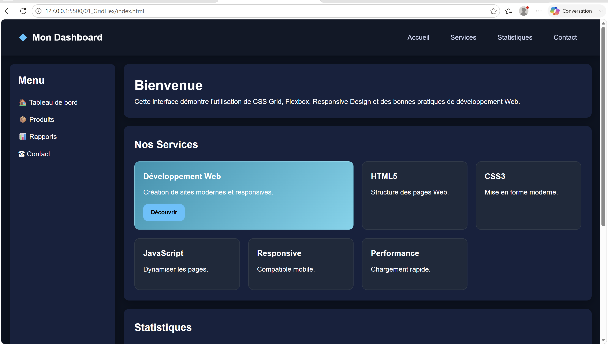
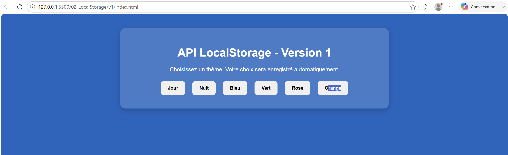
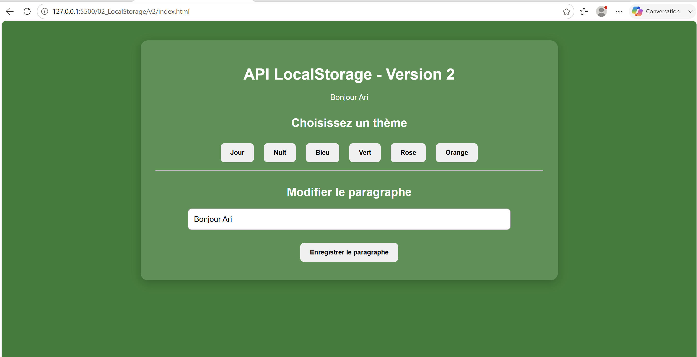

# 🌐 Développement Web - Atelier S1

---

# 📌 Description du projet

Ce projet a été réalisé dans le cadre du cours de **Développement Web**.

Il a pour objectif de mettre en pratique les notions fondamentales du développement front-end à travers plusieurs exercices permettant de manipuler :

* La structure d'une page web avec **HTML5**
* La mise en forme avec **CSS3**
* Les systèmes modernes de mise en page avec **CSS Grid** et **Flexbox**
* La programmation côté client avec **JavaScript**
* Le stockage des données directement dans le navigateur grâce à **LocalStorage**

Le projet est organisé en plusieurs parties représentant une progression dans l'apprentissage du développement web moderne.

---

# 🎯 Objectifs du projet

Les objectifs principaux de cet atelier sont :

* Comprendre la séparation entre la structure HTML, le style CSS et la logique JavaScript.
* Maîtriser les techniques modernes de création d'interfaces web.
* Apprendre à organiser un projet front-end.
* Manipuler les événements utilisateurs avec JavaScript.
* Utiliser le stockage local du navigateur.
* Conserver des données utilisateur sans utiliser de base de données.

---

# 📂 Composition du projet

Le projet contient trois parties principales :

---

# 1️⃣ Interface GridFlex

📁 Dossier :

```
01_GridFlex/
```

Cette partie présente une interface web construite avec les techniques modernes de mise en page :

* **CSS Grid**
* **Flexbox**

## Fonctionnalités :

✔ Organisation des composants avec Grid
✔ Alignement des éléments avec Flexbox
✔ Création d'une interface claire et structurée
✔ Utilisation du CSS moderne pour améliorer l'affichage

Cette partie permet de comprendre comment construire une page web responsive et bien organisée.

---

# 2️⃣ LocalStorage Version 1

📁 Dossier :

```
02_LocalStorage/v1/
```

Cette première version introduit l'utilisation du stockage local du navigateur.

L'objectif est de sauvegarder une préférence utilisateur.

## Fonctionnalité :

✔ Enregistrement du thème choisi par l'utilisateur.

Exemple :

1. L'utilisateur sélectionne un thème.
2. Le choix est enregistré dans le navigateur.
3. Après actualisation ou fermeture de la page, le thème est conservé.

---

# 3️⃣ LocalStorage Version 2

📁 Dossier :

```
02_LocalStorage/v2/
```

Cette version est une amélioration de la première.

Elle ajoute la sauvegarde d'un contenu textuel en plus du thème.

## Fonctionnalités :

✔ Sauvegarde du thème utilisateur
✔ Sauvegarde d'un paragraphe écrit par l'utilisateur
✔ Récupération automatique des informations enregistrées

Cette partie montre comment une application web peut conserver certaines données utilisateur directement côté navigateur.

---

# 🗂️ Structure du projet

```
S1_Intermediaire_Ariane_HODE/

│
├── index.html
│
├── README.md
│
├── README_Qualite.txt
│
├── 01_GridFlex/
│   │
│   ├── index.html
│   │
│   └── css/
│       └── style.css
│
└── 02_LocalStorage/
    │
    ├── v1/
    │   │
    │   ├── index.html
    │   │
    │   ├── css/
    │   │
    │   └── js/
    │
    └── v2/
        │
        ├── index.html
        │
        ├── css/
        │
        └── js/

```

---

# 🛠️ Technologies utilisées

| Technologie  | Description                            |
| ------------ | -------------------------------------- |
| HTML5        | Création de la structure des pages     |
| CSS3         | Mise en forme et design                |
| JavaScript   | Ajout des interactions dynamiques      |
| CSS Grid     | Création des layouts en grille         |
| Flexbox      | Gestion des alignements                |
| LocalStorage | Sauvegarde des données côté navigateur |

---

# ⚙️ Installation du projet

## Prérequis

Pour exécuter ce projet, il faut disposer de :

* Un navigateur récent :

  * Google Chrome
  * Mozilla Firefox
  * Microsoft Edge

* Visual Studio Code (recommandé)

* L'extension Live Server

---

# 🚀 Lancement du projet

## Méthode 1 : Avec Visual Studio Code + Live Server (recommandée)

### Étape 1 : Télécharger le projet

Cloner le dépôt GitHub :

```bash
git clone URL_DU_PROJET
```

ou télécharger directement le dossier du projet.

---

### Étape 2 : Ouvrir le projet

Ouvrir le dossier :

```
S1_Intermediaire_Ariane_HODE
```

avec Visual Studio Code.

---

### Étape 3 : Installer Live Server

Dans Visual Studio Code :

1. Aller dans l'onglet Extensions.
2. Rechercher :

```
Live Server
```

3. Installer l'extension.

---

### Étape 4 : Lancer une partie du projet

Faire un clic droit sur le fichier :

```
index.html
```

Puis choisir :

```
Open with Live Server
```

---

# 📌 Pages disponibles

Les différentes parties peuvent être lancées avec :

### Interface GridFlex

```
01_GridFlex/index.html
```

### LocalStorage Version 1

```
02_LocalStorage/v1/index.html
```

### LocalStorage Version 2

```
02_LocalStorage/v2/index.html
```

---

# 💾 Gestion du LocalStorage

Le projet utilise l'API JavaScript :

```javascript
localStorage
```

afin de stocker des informations directement dans le navigateur.

Les données sauvegardées restent disponibles même après :

* Actualisation de la page.
* Fermeture du navigateur.
* Nouvelle ouverture du projet.

---

# 📚 Compétences acquises

Grâce à ce projet, les compétences suivantes ont été développées :

✅ Création d'une interface web complète
✅ Organisation d'un projet front-end
✅ Utilisation avancée du CSS
✅ Création de layouts avec Grid et Flexbox
✅ Manipulation du DOM avec JavaScript
✅ Gestion des événements utilisateurs
✅ Utilisation du stockage local du navigateur
✅ Organisation d'un projet professionnel  
✅ Utilisation de Git et GitHub  

---

# 🔮 Améliorations possibles

Quelques améliorations possibles :

* Ajouter une meilleure responsivité mobile.
* Ajouter davantage d'animations CSS.
* Ajouter une validation des données utilisateur.
* Ajouter une interface plus complète.
* Connecter l'application à une base de données.

---


-----------------------------------------------
-----------------------------------------------
-----------------------------------------------

# 🚀 Mise en ligne du projet sur GitHub

## 📌 Présentation

Le projet a été versionné avec **Git** puis publié sur **GitHub** afin de permettre son stockage en ligne, le suivi des modifications et son partage facilement.

Les différentes étapes réalisées pour mettre le projet en ligne sont présentées ci-dessous.

---

# 1. Initialisation du dépôt Git local

Le projet a été ouvert dans Visual Studio Code puis un dépôt Git local a été créé dans le dossier du projet.

Commande utilisée :

```bash
git init
```

Cette commande permet de transformer le dossier du projet en dépôt Git afin de suivre les modifications réalisées.

---

# 2. Ajout des fichiers du projet

Tous les fichiers du projet ont été ajoutés au suivi Git avec la commande :

```bash
git add .
```

Cette commande ajoute l'ensemble des fichiers et dossiers du projet.

La vérification a été effectuée avec :

```bash
git status
```

Cette commande permet de vérifier les fichiers prêts à être enregistrés.

---

# 3. Création du premier commit

Une première version du projet a été enregistrée avec :

```bash
git commit -m "Initialisation du projet Developpement Web Atelier S1"
```

Le commit permet de sauvegarder une version du projet dans l'historique Git.

---

# 4. Création du dépôt GitHub

Un dépôt distant a été créé sur GitHub avec le nom :

```
S1-Developpement-Web-Atelier
```

Lien du repository :

```
https://github.com/arianehode/S1-Developpement-Web-Atelier
```

---

# 5. Configuration de la branche principale

La branche principale du projet a été renommée en `main` avec la commande :

```bash
git branch -M main
```

Cette branche correspond à la branche principale utilisée sur GitHub.

---

# 6. Connexion du projet local avec GitHub

Le dépôt local a été relié au repository GitHub grâce à :

```bash
git remote add origin https://github.com/arianehode/S1-Developpement-Web-Atelier.git
```

Cette commande permet d'établir la connexion entre le projet présent sur l'ordinateur et le dépôt GitHub.

---

# 7. Envoi du projet sur GitHub

Le projet a été envoyé sur GitHub avec :

```bash
git push -u origin main
```

Cette commande permet de transférer les fichiers du dépôt local vers GitHub.

Après cette étape, le projet devient accessible en ligne.

---

# 8. Ajout des captures d'écran dans le README

Afin d'améliorer la présentation du projet, un dossier `images` a été ajouté à la racine du projet.

Structure :

```
S1-Intermediaire-Ariane-HODE/

├── README.md
│
├── images/
│   ├── gridflex.png
│   ├── localstorage-v1.png
│   └── localstorage-v2.png
│
├── 01_GridFlex/
│
└── 02_LocalStorage/
```

Les captures d'écran des interfaces ont été placées dans ce dossier.

---

# 9. Affichage des images dans le README

Les images sont affichées dans le README avec la syntaxe Markdown :

```markdown

```

Exemple :

```markdown
## Interface GridFlex



## LocalStorage Version 1



## LocalStorage Version 2


```

GitHub affiche automatiquement les images dans la documentation.

---

# 10. Mise à jour du dépôt après modification

Après l'ajout des images ou toute modification du projet, les changements sont envoyés avec :

Ajouter les fichiers :

```bash
git add .
```

Créer un nouveau commit :

```bash
git commit -m "Ajout des captures d'écran du projet"
```

Envoyer les modifications :

```bash
git push
```

---

# ✅ Résultat final

Le projet est maintenant :

✅ Versionné avec Git  
✅ Hébergé sur GitHub  
✅ Accessible en ligne  
✅ Documenté avec un README complet  
✅ Illustré avec des captures d'écran  

Lien du projet :

```
https://github.com/arianehode/S1-Developpement-Web-Atelier
```
-----------------------------------------------
-----------------------------------------------
-----------------------------------------------

---

# 👤 Auteur

**Ariane HODE**

Projet réalisé dans le cadre du cours :

**Développement Web - Atelier S1**

Année académique :

**2025 - 2026**

---


# 🖥️ Aperçu du projet

## Interface GridFlex


## LocalStorage Version 1


## LocalStorage Version 2


---


# 📄 Licence

Projet personnel réalisé dans le cadre d'un apprentissage.

Tous les droits sont réservés à l'auteur.
